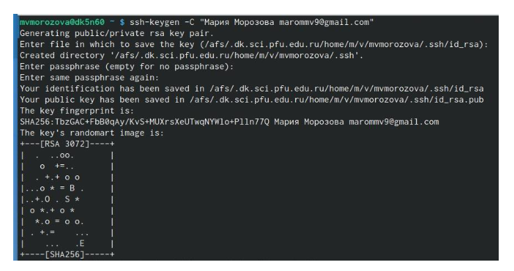

---
## Front matter
title: "Отчёт по лабораторной работе 2"
subtitle: "Архитектура компьютера"
author: "Морозова Мария Вячеславовна"

## Generic otions
lang: ru-RU
toc-title: "Содержание"

## Bibliography
bibliography: bib/cite.bib
csl: pandoc/csl/gost-r-7-0-5-2008-numeric.csl

## Pdf output format
toc: true # Table of contents
toc-depth: 2
lof: true # List of figures
lot: true # List of tables
fontsize: 12pt
linestretch: 1.5
papersize: a4
documentclass: scrreprt
## I18n polyglossia
polyglossia-lang:
  name: russian
  options:
	- spelling=modern
	- babelshorthands=true
polyglossia-otherlangs:
  name: english
## I18n babel
babel-lang: russian
babel-otherlangs: english
## Fonts
mainfont: PT Serif
romanfont: PT Serif
sansfont: PT Sans
monofont: PT Mono
mainfontoptions: Ligatures=TeX
romanfontoptions: Ligatures=TeX
sansfontoptions: Ligatures=TeX,Scale=MatchLowercase
monofontoptions: Scale=MatchLowercase,Scale=0.9
## Biblatex
biblatex: true
biblio-style: "gost-numeric"
biblatexoptions:
  - parentracker=true
  - backend=biber
  - hyperref=auto
  - language=auto
  - autolang=other*
  - citestyle=gost-numeric
## Pandoc-crossref LaTeX customization
figureTitle: "Рис."
tableTitle: "Таблица"
listingTitle: "Листинг"
lofTitle: "Список иллюстраций"
lotTitle: "Список таблиц"
lolTitle: "Листинги"
## Misc options
indent: true
header-includes:
  - \usepackage{indentfirst}
  - \usepackage{float} # keep figures where there are in the text
  - \floatplacement{figure}{H} # keep figures where there are in the text
---

# Цель работы

Изучить идеологию и применение средств контроля версий. Приобрести
практические навыки по работе с системой git.

# Задание

1. Создайте отчет по выполнению лабораторной работы в соответствующем каталоге
рабочего пространства (labs>lab02>report).
2. Скопируйте отчеты по выполнению предыдущих лабораторных работ в соответствую-
щие каталоги созданного рабочего пространства.
3. Загрузите файлы на github.

# Теоретическое введение

Системы контроля версий (Version Control System, VCS) применяются при работе
нескольких человек над одним проектом. Обычно основное дерево проекта хранится в
локальном или удалённом репозитории, к которому настроен доступ для участников про-
екта. При внесении изменений в содержание проекта система контроля версий позволяет
их фиксировать, совмещать изменения, произведённые разными участниками проекта,
производить откат к любой более ранней версии проекта, если это требуется.

# Выполнение лабораторной работы

Создаём учётную запись на сайте https://github.com/ и проводим базовую
настройку: (рис. @fig:001).

{#fig:001 width=70%}

Указываем имя и email владельца репозитория. (рис. @fig:002).

{#fig:002 width=70%}

Настроим utf-8 в выводе сообщений git. (рис. @fig:003).

{#fig:003 width=70%}

Зададим имя начальной ветки. (рис. @fig:004).

{#fig:004 width=70%}

Задаём параметры autocrlf, safecrlf. (рис. @fig:005).

{#fig:005 width=70%}

Сгенерировали пару ключей (приватный и открытый). (рис. @fig:006).

{#fig:006 width=70%}

Скопировали из локальной консоли ключ в буфер обмена. (рис. @fig:007).

{#fig:007 width=70%}

Создали SSH ключ на github. (рис. @fig:008).

{#fig:008 width=70%}

Открываем терминал и создаём каталог для предмета «Архитектура
компьютера». (рис. @fig:009).

{#fig:009 width=70%}

Создаём репозиторий на основе шаблона через web-интерфейс github. (рис. @fig:0010).

{#fig:0010 width=70%}

Переходим в каталог курса. (рис. @fig:011).

{#fig:011 width=70%}

Клонируем созданный репозиторий с помощью git clone. (рис. @fig:012).

{#fig:012 width=70%}

Переходим в каталог курса с помощью cd. (рис. @fig:013).

{#fig:013 width=70%}

Удаляем лишние файлы с помощью rm (рис. @fig:014).

{#fig:014 width=70%}

Создаём необходимые каталоги. (рис. @fig:015).

{#fig:015 width=70%}

 Отправляем файлы на сервер, используя git add, git commit. (рис. @fig:016).

{#fig:016 width=70%}

#Задание для самостоятельной работы

Помещаем готовые отчёты по выполнению лабораторных работ в
соответствующие каталоги рабочего пространства. (рис. @fig:017).

{#fig:017 width=70%}

Загружаем файлы на github с помощью git add. (рис. @fig:018).

{#fig:018 width=70%}

Проверяем наличие файлов на сайте. (рис. @fig:019).

{#fig:019 width=70%}

# Выводы

После выполнения лабораторной работы были приобретены практические
навыки по работе с системой git. Изучена идеология и применение средств
контроля версий.

