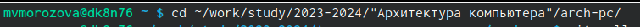
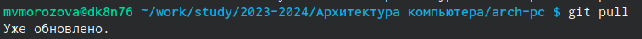
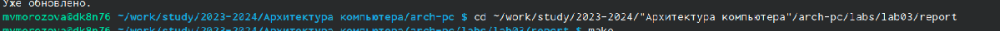
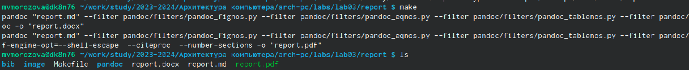
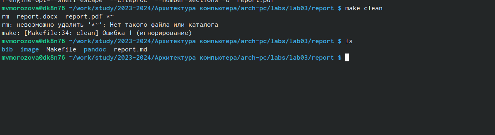
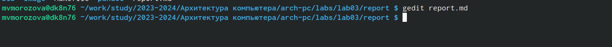

---
## Front matter
title: "Отчёт по лабораторной работе 3"
subtitle: "Архитектура компьютера"
author: "Морозова Мария Вячеславовна"

## Generic otions
lang: ru-RU
toc-title: "Содержание"

## Bibliography
bibliography: bib/cite.bib
csl: pandoc/csl/gost-r-7-0-5-2008-numeric.csl

## Pdf output format
toc: true # Table of contents
toc-depth: 2
lof: true # List of figures
lot: true # List of tables
fontsize: 12pt
linestretch: 1.5
papersize: a4
documentclass: scrreprt
## I18n polyglossia
polyglossia-lang:
  name: russian
  options:
	- spelling=modern
	- babelshorthands=true
polyglossia-otherlangs:
  name: english
## I18n babel
babel-lang: russian
babel-otherlangs: english
## Fonts
mainfont: PT Serif
romanfont: PT Serif
sansfont: PT Sans
monofont: PT Mono
mainfontoptions: Ligatures=TeX
romanfontoptions: Ligatures=TeX
sansfontoptions: Ligatures=TeX,Scale=MatchLowercase
monofontoptions: Scale=MatchLowercase,Scale=0.9
## Biblatex
biblatex: true
biblio-style: "gost-numeric"
biblatexoptions:
  - parentracker=true
  - backend=biber
  - hyperref=auto
  - language=auto
  - autolang=other*
  - citestyle=gost-numeric
## Pandoc-crossref LaTeX customization
figureTitle: "Рис."
tableTitle: "Таблица"
listingTitle: "Листинг"
lofTitle: "Список иллюстраций"
lotTitle: "Список таблиц"
lolTitle: "Листинги"
## Misc options
indent: true
header-includes:
  - \usepackage{indentfirst}
  - \usepackage{float} # keep figures where there are in the text
  - \floatplacement{figure}{H} # keep figures where there are in the text
---

# Цель работы

Целью работы является освоение процедуры оформления отчетов с помощью легковесного языка разметки Markdown.

# Задание

1. В соответствующем каталоге сделайте отчёт по лабораторной работе №2 в формате Markdown. В качестве отчёта необходимо предоставить отчёты в 3 форматах: pdf, docx и md.
2. Загрузите файлы на github.

# Теоретическое введение

Markdown — облегчённый язык разметки, созданный с целью обозначения форматирования в простом тексте, с максимальным сохранением его читаемости человеком, и пригодный для машинного преобразования в языки для продвинутых публикаций.

# Выполнение лабораторной работы
Переходим в каталог курса сформированный при выполнении лабораторной работы №2
(рис. [-@fig:001]).

{#fig:001 width=70%}

Обновляем командный репозиторий с помощью команды git pull (рис. [-@fig:002]).

{#fig:002 width=70%}

Переходим в каталог с шаблоном отчёта по лабораторной работе №3 (рис. [-@fig:003]).

{#fig:003 width=70%}

Компилируем шаблон с использованием Makefile, а затем проверяем наличие файлов с помощью команды ls (рис. [-@fig:004]).

{#fig:004 width=70%}

С помощью команды make clean удаляем созданные файлы, проверяем, что они удалены с помощью ls (рис. [-@fig:005]).

{#fig:005 width=70%}

Открываем файл report.md c помощью текстового редактора gedit (рис. [-@fig:006]).

{#fig:006 width=70%}

Далее я заполнила отчёт, скомпилировала его и выгрузила на github.

# Выполнение заданий для самостоятельной работы.

Открываем файл report.md c помощью текстового редактора gedit (рис. [-@fig:007]).

{#fig:007 width=70%}

# Выводы

В ходе работы была освоена процедура оформления отчетов с помощью легковесного языка разметки Markdown, я познакомилась с основными возможностями разметки. С помощью модификации данного шаблона я подготовила отчёт по лабораторным работам.

