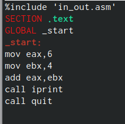
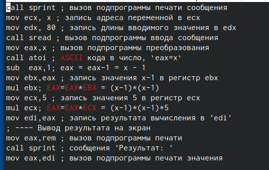

---
## Front matter
title: "Отчёт по лабораторной работе №6"
subtitle: "Архитектура компьютера"
author: "Морозова Мария Вячеславовна"

## Generic otions
lang: ru-RU
toc-title: "Содержание"

## Bibliography
bibliography: bib/cite.bib
csl: pandoc/csl/gost-r-7-0-5-2008-numeric.csl

## Pdf output format
toc: true # Table of contents
toc-depth: 2
lof: true # List of figures
lot: true # List of tables
fontsize: 12pt
linestretch: 1.5
papersize: a4
documentclass: scrreprt
## I18n polyglossia
polyglossia-lang:
  name: russian
  options:
	- spelling=modern
	- babelshorthands=true
polyglossia-otherlangs:
  name: english
## I18n babel
babel-lang: russian
babel-otherlangs: english
## Fonts
mainfont: PT Serif
romanfont: PT Serif
sansfont: PT Sans
monofont: PT Mono
mainfontoptions: Ligatures=TeX
romanfontoptions: Ligatures=TeX
sansfontoptions: Ligatures=TeX,Scale=MatchLowercase
monofontoptions: Scale=MatchLowercase,Scale=0.9
## Biblatex
biblatex: true
biblio-style: "gost-numeric"
biblatexoptions:
  - parentracker=true
  - backend=biber
  - hyperref=auto
  - language=auto
  - autolang=other*
  - citestyle=gost-numeric
## Pandoc-crossref LaTeX customization
figureTitle: "Рис."
tableTitle: "Таблица"
listingTitle: "Листинг"
lofTitle: "Список иллюстраций"
lotTitle: "Список таблиц"
lolTitle: "Листинги"
## Misc options
indent: true
header-includes:
  - \usepackage{indentfirst}
  - \usepackage{float} # keep figures where there are in the text
  - \floatplacement{figure}{H} # keep figures where there are in the text
---

# Цель работы

Освоение арифметических инструкций языка ассемблера NASM.

# Задание

Написать программу вычисления выражения y=f(x).

# Теоретическое введение

Схема команды целочисленного сложения add (от англ. addition - добавление) выполняет
сложение двух операндов и записывает результат по адресу первого операнда.
Команда add
работает как с числами со знаком, так и без знака и выглядит следующим образом:
add <операнд_1>, <операнд_2>
Команда целочисленного вычитания sub (от англ. subtraction – вычитание) работает анало-
гично команде add и выглядит следующим образом:
sub <операнд_1>, <операнд_2>
Еще одна команда, которую можно отнести к арифметическим командам это команда
изменения знака neg:
neg <операнд>
Умножение и деление, в отличии от сложения и вычитания, для знаковых и беззнаковых
чисел производиться по-разному, поэтому существуют различные команды.
Для беззнакового умножения используется команда mul (от англ. multiply – умножение):
mul <операнд>
Для знакового умножения используется команда imul:
imul <операнд>
Для деления, как и для умножения, существует 2 команды div (от англ. divide - деление) и
idiv:
div <делитель> ; Беззнаковое деление
idiv <делитель> ; Знаковое деление

# Выполнение лабораторной работы

Создала каталог для программ лабораторной работы No 6, перешла в него и
создала файл lab6-1.asm. (рис. @fig:001).

{#fig:001 width=70%}

Создала исполняемый файл и запустила его. (рис. @fig:003).

{#fig:003 width=70%}

Изменила текст программы и вместо символов, записала в регистры числа. (рис. @fig:004).

{#fig:004 width=70%}

Создала исполняемый файл и запустила его. (рис. @fig:005).

{#fig:005 width=70%}

Изменила текст программы. (рис. @fig:006).

{#fig:006 width=70%}

Создала файл, скомпоновала его и запустила. (рис. @fig:007).

{#fig:007 width=70%}

Изменила текст программы. (рис. @fig:008).

{#fig:008 width=70%}

Создала исполняемый файл и запустила его. (рис. @fig:009).

{#fig:009 width=70%}

Заменила iprintLF на iprint. (рис. @fig:010).

{#fig:010 width=70%}

Создала исполняемый файл и запустила его. (рис. @fig:011).

{#fig:011 width=70%}

Создала файл lab6-3.asm в каталоге lab06. (рис. @fig:012).

{#fig:012 width=70%}

Ввела текст программы из листинга. (рис. @fig:013).

{#fig:013 width=70%}

Создала исполняемый файл и запустила его. (рис. @fig:014).

{#fig:014 width=70%}

Изменила текст программы. (рис. @fig:015).

{#fig:015 width=70%}

Создала исполняемый файл, запустила его, чтобы проверить его работу. (рис. @fig:016).

{#fig:016 width=70%}

Создала файл variant.asm. (рис. @fig:017).

{#fig:017 width=70%}

Ввела текст из листинга. (рис. @fig:018).

{#fig:018 width=70%}

Создала исполняемый файл и запустила его, узнала номер варианта. (рис. @fig:019).

{#fig:019 width=70%}

# Ответы на вопросы

1. За вывод сообщения “Ваш вариант” отвечают строки:
mov eax,rem
call sprint
2. mov ecx, x - используют, чтобы положить адрес вводимой строки x в регистр ecx 
mov edx, 80 - запись в регистр edx длины вводимой строки 
call sread - вызов подпрограммы из внешнего файла, обеспечивающей ввод сообщения с клавиатуры
3. call atoi - вызов подпрограммы из внешнего файла, которая преобразует ascii-код символа в целое число и записывает результат в регистр eax
4. За вычисления варианта отвечают строки:
xor edx,edx ; обнуление edx для корректной работы div
mov ebx,20 ; ebx = 20
div ebx ; eax = eax/20, edx - остаток от деления
inc edx ; edx = edx + 1
5. При выполнении инструкции div ebx остаток от деления записывается в регистр edx
6. Инструкция inc edx прибавляет 1 к значению регистра edx
7. За вывод на экран результатов вычислений отвечают строки:
mov eax,edx
call iprintLF

# Выполнение самостоятельной работы

Написала программу для вычисления выражения y=f(x). (рис. @fig:020).

{#fig:020 width=70%}

Проверка работы программы для x1. (рис. @fig:021).

{#fig:021 width=70%}

Проверка работы программы для x2. (рис. @fig:022).

{#fig:022 width=70%}

# Листинги
```
%include 'in_out.asm' ; подключение внешнего файла
SECTION .data ; секция инициированных данных
msg: DB 'Введите значение переменной х: ',0
rem: DB 'Результат: ',0
SECTION .bss ; секция не инициированных данных
x: RESB 80 ; Переменная, значение к-рой будем вводить с клавиатуры, выделенный размер - 80 байт
SECTION .text ; Код программы
GLOBAL _start ; Начало программы
_start: ; Точка входа в программу
; ---- Вычисление выражения
mov eax, msg ; запись адреса выводимиого сообщения в eax
call sprint ; вызов подпрограммы печати сообщения
mov ecx, x ; запись адреса переменной в ecx
mov edx, 80 ; запись длины вводимого значения в edx
call sread ; вызов подпрограммы ввода сообщения
mov eax,x ; вызов подпрограммы преобразования
call atoi ; ASCII кода в число, `eax=x`
sub  eax,1; eax = eax-1 = x - 1
mov ebx,eax ; запись значения x-1 в регистр ebx
mul ebx; EAX=EAX*EBX = (x-1)*(x-1)
mov ecx,5 ; запись значения 5 в регистр ecx
mul ecx; EAX=EAX*ECX = (x-1)*(x-1)*5
mov edi,eax ; запись результата вычисления в 'edi'
; ---- Вывод результата на экран
mov eax,rem ; вызов подпрограммы печати
call sprint ; сообщения 'Результат: '
mov eax,edi ; вызов подпрограммы печати значения
call iprint ; из 'edi' в виде символов
call quit ; вызов подпрограммы завершения
```

# Выводы

Были освоены арифметические инструкции языка ассемблера NASM.


